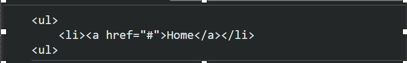

> 5강 문

###

값(value)은 식이 평가되어 생성된 결과이다.

```
//10 + 20은 평가되어 숫자 값 30을 생성한다.
10 + 20 ; //30
```

리터럴 : 사람이 이해할 수 있는 문자 또는 약속된 기호를 사용해
값을 생성하는 표기법

```
//숫자 리터럴 3
3
```

<br>

> 6강 데이터 타입

###

숫자 타입의 값은 주로 산술연산자를 위해 생성하지만, 문자열
타입은 주로 텍스트를 화면에 출력하기 위해 생성한다.
서로 확보해야 할 메모리 공간의 크기가 다르고 메모리에 저장되는 2진수도 다르며 읽어 들여 해석하는 방식도 다르다.

```
//문자열 타입
var string;
string = '문자열'; //작은따옴표
string = "문자열"; //큰따옴표
string = `문자열`: //백틱 (ES6)
```

---

\*\*\* [템플릿리터럴]<br>
템플릿 리터럴은 멀티라인 문자열, 표현식 삽입, 태그 템플릿등
편리한 문자열 처리 기능을 제공한다.

```
 var template = `<ul>\n\t<li><a href="#">Home</a></li>\n<ul>;

 console.log(template);
 아랯처럼 출력된다.
```

## 

\*\*\* 백틱 사용법

```
var first = 'ung=mo';
var last = 'lee';
console.log(`My name is : ${first} ${lee}');

```


\*\*\* 데이터 타입<br> -자바스크립트는 정적 타입 언어와 다르게 변수를 선언하때 타입을 선언하지 않는다.
var, let, const키워드를 상요해 변수를 선언할 뿐이다.
변수가 나온김에 var와 const를 비교하고 가보자
var를 쓰면 안돼는 이유!!

### var와 const비교

- var

```
// 선언을 먼저 하지 않았는데도 출력이 된다.

{
  age = 40; //할당
  var age; //선언
}
console.log(age);
```

- const

```
//선언먼저 하라는 error메세지가 나온다.

{
  age = 40; //할당
  let age; //선언
}
console.log(age);

```

\*\*\* typeof<br>
변수를 하나 선ㅇ너하고 지금까지 살펴본 다양한 데이터 타입의 값을 할당한다음,
typeof 연산자로 변수의 데이터 타입을 조사해보자.
typeof 연산자는 연산자 뒤에 위치한 피연산자의 데이터 타입을 문자열로 반환한다.

```
var foo;
console.log(typeof foo); //undefined

foo = 3;
consoloe.log(typeof foo); //number

foo = null;
console.log(typeof foo); //object

foo = true;
console.log(typeof foo); //boolean

foo = {}; //객체
console.log(tyopeof foo);// object

foo = []; //배열
console.log(typeof foo); // object

foo = function(){}; //함수
console.log(type foo); //function
```

---> 자바스크립트에서는 값을 할당하는 시점에 변수의 타입이 동적으로 결정되고
변수의 타입을 언제드지 자유롭게 변경 할 수 있다.<br>
---> 자바스크립트의 변수는 선언이 아닌 할당에 의해 타입이 결정된다.
그리고 재할당에 의해 변수의 타입은 언제든지 동적으로 변할 수 있다.
