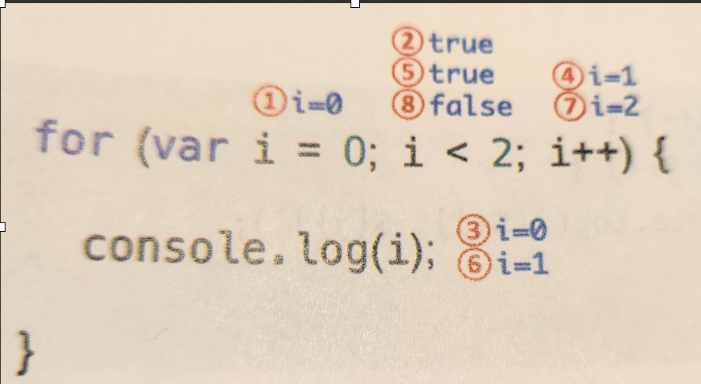

> ## 8강 제어문<br>

> ### 8-1 블록문<br>
>
> >

```
//블록문
{
    var foo = 10;
}

//제어문
var x = 1;
if (x < 10){
    x++;
}

//함수선언문
function sum(a,b){
    return a + b;
}
```

> ### 8-2 조건문<br>

<span style="color:lightblue">
// if..else문
</span><br>

```
if (조건식){
    //조건이 참이면 이 코드 블록이 샐행된다.
}else {
    //조건이 거짓이면 이 코드 블록이 실행된다.
}
```

조건식을 추가하여 조건에 따라 실행될 코드블록을 느릴고싶으면,

```
if (조건1){
    //조건이 참이면 이 코드 블록이 샐행된다.
}else if (조건2) {
    //조건2가 참이면 이 코드 블록이 실행된다.
}else {
    // 조건1과 조건2rk 모두 거짓이면 이 코드 블록이 실행된다.
}
```

(ex) 양수, 음수를 구별하시오.<br>
--> 0보다 크면 양수, 작으면 음수,<br>
--> 모가?..kind가
--> 첵에서는 var num = 2를 주었는데 왜??

```
var kind; //선언만 함.

if (kind > 0) {
  console.log(`${kind}는 양수입니다.`);
} else {
  console.log(`${kind}는 음수입니다.`);
}
// undifined는 음수입니다.출력

if (kind < 0) {
  console.log(`${kind}는 음수입니다.`);
} else if (kind > 0) {
  console.log(`${kind}는 양수입니다.`);
} else {
  console.log(`${kind}는 0입니다.`);
}
// undivined는 0입니다.--출력
```

위의 코드에서 undifined로 출력되는 이유는.
javascript에서는 초기화 값을 넣어줘야 한다.

선언만 하고 할당을 하지 않았다. 그럼 아래처럼 입력해볼까?<br>
(초기화 값을 넣어주지 않을거면..)

```
var kind; // 선언

// kind에 어떤 값도 할당하지 않으면, 여기서는 undefined가 됩니다.

if (kind === undefined) {
  console.log(`kind는 정의되지 않았습니다.`);
} else if (kind > 0) {
  console.log(`${kind}는 양수입니다.`);
} else if (kind < 0) {
  console.log(`${kind}는 음수입니다.`);
} else {
  console.log(`${kind}는 0입니다.`);
}

```

아래처럼 해줘야 한다. (책)<br>
사용되는 변수가 해당 조건을 판단하기에 적절하게 정의되어 있어야한다는 것!! 선언.할당

1.  변수로 할 경우

```
var num = 2;
if (num > 0) {
    var kind = '양수';
}
console.log(kind); // "양수"

```

2. 숫자로 대입

```
var kind = 2;
if (kind > 0) {
    var kind = '양수';
}
console.log(kind); // "양수"
```

// 그럼 if..else와 if else if else로 바꿔보자.

var kind; //선언 <br>
var num = 2;

```
 if문-----

 if (num > 0) {
  var kind = "양수";
}
console.log(kind); // "양수"
```

```
if else문------
if (num > 0) {
    kind = "양수";
} else {
    kind = "음수";
}
console.log(kind);
```

```
if..else if문------
if (num > 0) {
  kind = "양수";
} else if (num < 0) {
  kind = "음수";
} else {
  kind = "영";
}
console.log(kind); //num의 값에 따라..
```

```
삼항조건식으로 변환 (두개의 조건)
var kind = num > 0 ? kind="양수" : kind="음수" ;

삼항조건식으로 변환 (세개의 조건)
var kind = num ? (num > 0 ? (kind = "양수") : (kind = "음수")) : "영";
```

- ### switch 문 <br>

```
> switch(표현식) {
    case 표현식1:
        switch문의 표현식과 표현식1일 일치하면 실행될 문;
        break;
}   case 표현식2:
        switch문의 표현식과 표현식2가 일치하면 실행될 문;
        break;
    defalut:
        switch문의 표현식과 일치하는 case문이 없을때 실행될 문;
```

> if..else문의 조건식은 불리언값으로 평가되어야 하지만,<br>
> switch문의 표현식은 불리언값보다 문자열이나 숫자값인 경우가 많다.

(ex)

```
//월을 영어로 변환한다. (11 -> November)
var month = 11;
var monthName;

switch (month){
    case 1:
    monthName = 'Jaunary';
    break;

    case 2:
    monthName = 'february';
    break;
    .....
    case 11:
    monthName = 'November;'
    break;

    case 12:
    monthName = 'september';
    break;

    default:
    monthName = 'Invalid month';
}
console.log(month); // 11로 출력
```

> ### 8-3 반복문<br>

- ### for 문 <br>


-->
변수 선언문의 실행이 종료되면 조건식이 실행된다.<br>
현재 i변수의 값은 0이므로 조건식의 평가 결과는 true이다.<br>
조건식의 평가 결과가 true이므로, 코드블록이 실행된다.

```
(ex) 0에서 10까지 모두 출력

for (var i = 0; i < 2; i++>){
    console.log(i)
}
```

(ex) 0에서 10까지 짝수만 출력

```
for (var i = 0; i < 11; i = i + 2) {
  console.log(i);
}
```

- 다른해답 - 0에서 10까지 홀수만 출력

```
for (let i = 0; i < 11; i++) {
  if (i % 2 === 0) {
    continue;
  }
  console.log(`q1. ${i}`);
}
```

- ### while 문 <br>
  --> 주어진 조건식의 평가 결과가 참이면 코드블록을 계쏙해서 반복 실행한다. for문은 반복 횟수가 명확할떄 주로 사용하고, while문은 반복 횟수가 불명확할떄 주로 사용한다.<br>
  --> 조건문의 평가 결과가 거짓이면 코드 블록을 실행하지 않고 종료한다.

```
var count = 0;
//count가 3보다 작을떄까지 코드블록을 계속 반복 실행한다.
while (count < 3) {
  console.log(count);
  count++;
} //0 1 2 가 출력된다.
```

// 무한루프에서 탈출하기 위해서는 코드 블록 내에서 if문으로
탈출 조건을 만들고 break문으로 코드 블록을 탈출한다.

```
var count = 0;

while (count < 3){
console.log(count);
count++;
//count가 3이면 코드블록을 탈출한다.
if(count === 3) break;
} // 0 1 2 출력
```

- ### do..while 문 <br>
  --> 코드 블록을 먼저 실행하고 조건식은 나중에.<br>
  --> 코드 블록은 무조건 한번 이상 실행된다.

```
var count = 5;

do {
  console.log(`do while: ${count}`);
  i--;
} while (count > 0); // 5, 4, 3, 2, 1로 출력됨.
```

<span style="color:lightblue">
--> 과정설명<br>
</span>

1. 초기화: var count = 5;로 시작합니다. 이 때, count 변수의 값은 5입니다.

2. do 블록 실행: 루프의 첫 번째 단계로, do 블록이 실행됩니다. 이 블록 내에 있는 console.log(do while: ${count});가 실행되어 현재 count 값인 5를 출력합니다.

3. 카운터 감소: count--;가 실행되어 count의 값이 1 감소합니다. 처음에는 5에서 4가 됩니다.

4. 조건 검사: while (count > 0); 조건을 검사합니다. 처음 검사할 때 count는 4이므로, 이 조건은 참입니다.

5. 조건이 참인 경우: 조건이 참이므로, do 블록으로 돌아가서 다시 실행합니다. 이 때 count의 값은 4이므로, "do while: 4"를 출력합니다.

6. 과정 반복: 이 과정 (카운터 감소 → 조건 검사 → do 블록 실행)을 count의 값이 0보다 클 동안 계속 반복합니다. 따라서, count가 4, 3, 2, 1일 때 각각 "do while: 4", "do while: 3", "do while: 2", "do while: 1"을 출력합니다.

7. 루프 종료: count가 1에서 0으로 감소한 후, 조건 while (count > 0);을 다시 검사합니다. 이 때 count는 0이므로, 조건은 거짓이 되고 루프는 종료됩니다.

- ### break문과 continue 차이

  break문 : 코드 블록을 탈출한다.
  continue : 반복문의 코드 블록 실행을 현 시점에서 중단하고 반복문의 증감식으로 실행, break문처럼 반복문을 탈출하지 않는다.<br>

  - ### break문

```
for (let i = 0; i < 10; i++) {
  if (i % 2 == 0) {
  continue; 잠시 멈추고 다음 반복문을 실행한다.
}
  console.log(i); // 1 3 5 7 9 출력된다.
 }
```

<span style="color:lightblue">
--> 과정설명
</span>

1. continue 문은 현재 실행 중인 반복문의 나머지 코드를 건너뛰고, 반복문의 다음 반복(즉, 다음 주기)으로 진행하도록 합니다. 하지만, continue 문이 실행되면, 그 시점에서 현재 반복문의 나머지 코드(여기서는 console.log(i))는 실행되지 않고, 반복문은 다음 반복 조건으로 넘어갑니다.

2. 즉, 코드에서 i % 2 === 0 조건이 참일 때, 즉 i가 짝수일 때 continue가 실행되어 현재 반복의 console.log(i) 실행을 건너뛰고, 반복문의 조건 검사로 바로 이동합니다. 이 때문에 console.log(i)는 짝수일 때 실행되지 않습니다.
   예시 코드에서 continue 때문에 console.log(i)가 짝수 i에 대해 실행되지 않으니, 홀수인 1, 3, 5, 7, 9만 출력됩니다.

3. "다음 반복으로 넘어간다"는 말은, continue로 인해 현재 반복의 남은 부분(여기서는 console.log(i))을 건너뛰고, 반복문의 i++ 실행(즉, i의 증가)과 그 후의 조건 검사로 바로 넘어간다는 의미이다.

- ### break 문<Br>

```
. 내가 푼 첫번째

for (let i = 0; i < 10; i++) {
    if (i === 5) {
        break; // i가 5가 되면 반복문을 종료합니다.
    }
    console.log(i); // 0, 1, 2, 3, 4까지 출력하고 종료됩니다.
}
------------------------------------------------
. 책에 나온 2번쨰

for (let i = 0; i < 4; i++) {
  if (i === 5) {
    break;
  }
  console.log(i); // 0 1 2 3 4 출력
}


```
