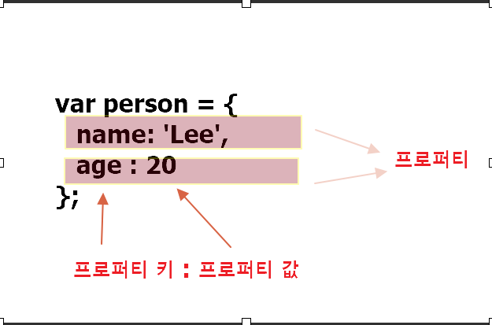
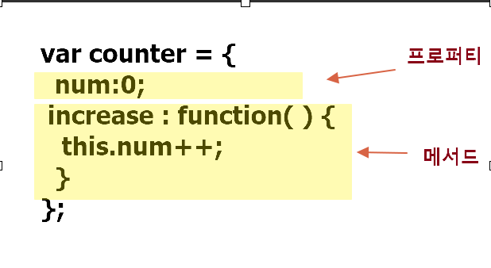

> ### 10.1 객체란

- 자바스크립트는 객체(object)기반의 프로그래밍 언어이며,
  원시 값을 제외한 나머지 값 (함수, 배열, 정규 표현식 등)은 모두 객체다.
- 객체는 0개의 이상의 프로퍼티로 구성된 집합이며, 프로퍼티는 키(key)와 값(value)으로 구성된다.




-->프로퍼티 값이 함수일 경우, 일반함수와 구분하기 위해 메서드라 부른다.

- 프로퍼티 : 객체의 상태를 나타내는 값
- 메서드 : 프로퍼티(상태 데이터)를 참조하고 조작할 수 있는 동작, <br>
- 객체 : 객체의 상태를 나타내는 값(프로퍼티)과 프로퍼티를 <br>
  참조하고 조작할 수 있는 동작(메서드)을 모두 포함할 수 있기 대문에 상태와 동작을 하나의 단위로 구조화 할 수 있어 유용하다.

> - ### 객체생성 방법

---

1. 객체 리터럴
2. object 생성자 함수
3. 생성자 함수
4. object.create 메서드
5. 클래스(ES6)

```
var person = {
    name:'Lee',
    sayHello:function() {
        console.log(`Hello! My name is ${this.name}.`);
    }
};

console.log(typeof person);
console.log(person);    // {name:'Lee', sayHello:f}
```

- 중괄호 내에 프로퍼티를 정의하지 않으면 빈 객체가 생성된다.
  var empty = {} // 빈 객체
  console.log(typeof empty); //object

> ### 10.3 프로퍼티
>
> 객체는 프로퍼티의 집합이며, 프로퍼티는 키와 값으로 구성

- 빈 문자열도 프로퍼티 키로 사용할수 있다.
- var, function과 같은 예약어를 프로퍼티 키로 사용해도 에러가 발생하지 않는다.
- 이미 존재하는 프로퍼티 키를 중복 선언하면 나중에 선언한
  프로퍼티 키가 선언한 프로퍼티를 덮어쓴다.

```
var foo = {
  var:'',
  function : ''
};
console.log(foo);   // {var:"", function:""}
```

```
var foo = {
  name:'lee',
  name:'kim
};
console.log(foo) // {name : "kim"}
```

> ### 프로퍼티 접근

- 마침표 프로퍼티 접근 연산자(.)를 사용하는 마침표 표기법
- 대괄호 프로퍼티 접근 연산자([...])를 사용하는 대괄호 표기법

(ex)

```
let person = {
  name :'lee'
};

// 마침표 표기법에 의한 프로퍼티 접근
console.log(person.name);   // lee

//  대괄호 표기법에 의한 프로퍼티 접근
console.log(person(['name'])); // lee
```

> ### 프로퍼티 갱신

```
let person = {
name:'park'
};
person.name = 'tae';
console.log(person); // {name:'tae'
}

```

> ### 프로퍼티 동적 생성

- 존재하지 않는 프로퍼티에 값을 할당하면 프로퍼티가 동적으로 생성되어 추가되고, 프로퍼티 값이 할당 된다.

```
let person = {
  name:'lee'
};

// person객체에는 age 프로퍼티가 존재하지않는다.
// 따라서 person 객체에 age 프로퍼티가 동적으로 생성되고
값이 할당된다.

person.age  = 40;

console.log(person);  // {name : 'lee', age: 40}
```

> ### 프로퍼티 삭제

- 객체의 프로퍼티를 삭제한다. 그러므로 프로퍼티 값에 접근할 수 있는 표현식 이어야한다.

```
let person = {
  name : 'lee'
};
person.age = 40;
console.log(person);

delete person.age;

console.log(person); // { name:'lee'}
```

> ### 메서드 축약 표현

- ES5에서 메서드를 정의하려면 프로퍼티 값으로 함수를 할당한다.

```
//ES5

let obj = {
  name: "lee",
  sayHi: function () {
    console.log(`hi` + this.name);
  },
};
obj.sayHi(); // hilee

// ES6

let obj1 = {
  name: "park",
  sayHi() {
    console.log(`HI` + this.name);
  },
};
obj1.sayHi();

ES6에서는 메서드를 정의할때 function 키워드를 생략한
축약 표현을 수 있다.
```
