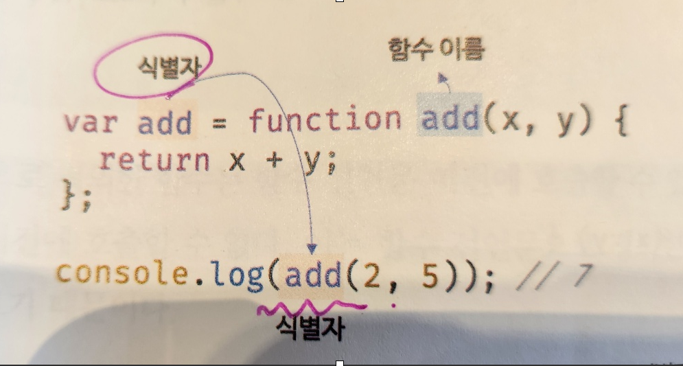

> ## 12.함수

### 1. 함수 선언문

> ### 작동원리
>
> --> 자바스크립트 엔진은 함수 선언문을 해석해 함수 객체를 생성한다.
> 이떄 함수 이름은 함수 몸체 내부에서만 유효한 식별자 이므로 함수 이름과는 별도로 생성된 함수 객체를 가리키는 식별자가 필요하다. <br>
> 함수 객체를 가리키는 식별자가 없으면 생성된 함수 객체를 참조할 수 없으므로 호출할 수도 없다.<br>
> 따라서 자바스크립트엔진은 생성된 함수를 호출하기 위해 함수 이름과 동일한 이름의 식별자를 암묵적으로
> 생성하고, 거기에 함수 객체를 할당한다.

--> 함수는 함수 이름으로 호출하는 것이 아니라, 함수 객체를 가리키는 식별자로 호출한다.
즉, 함수를 호출하는 것은 함수 이름 add가 아니라 자바스크립트 엔진이 암묵적으로 생성한 식별자 add 인것이다.<br>
함수 이름과 변수 이름이 일치하므로, 함수 이름으로 호출되는 듯하지만, 사실은 식별자로 호출된 것이다.

--> javascript에서는 함수를 객체로 취급한다.
add는 메모리 상에서 해당함수 코드를 포함하고 있는 객체의 참조를 저장하고 있다.
add(1,2)를 실행할때, javascript엔진은 add 식별자가 가라키는 메모리 주소로 가서 해당 함수 객체를 찾아내고, 그 객체에 포함된 코드를 실행한다.
이 과정에서 1과2는 함수의 매개변수 x와 y에 각각 대입되어, 변환값인 3이 계산된다.

```
let add = function add(x,y){
    return x + y;
};
console.log(add(2,5)); // 7
```



### 2. 함수 표현식

익명함수 (함수이름 생략)라고 한다.

```
let add = funciton (x,y){
   return x + y;
}
console.log(`합은 ${add}입니다.')
```

// 기명함수 표현식

```
let sum6 = function foo(x, y) {
return x + y;
};
console.log(sum6(20, 40)); // 60

console.log(foo(20, 40)); // error
--> 함수이름은 함수 몸체 내부에서만 유효한 식별자이다.

// 비교 일반함수
   function foo(x, y) {
   return x + y;
   }
   console.log(foo(2, 5)); // 6
```

### 3. 화살표함수

화살표함수 :
(매개변수) => {함수내용}

1. 매개변수가 없을때는 매개변수가 들어가는 소괄호 부분을 비어둔다.
2. 실행할 명령이 한줄이면 중괄호{ } 를 생략할 수 있다.
3. 한줄 명령어에 return이 있으면 return도 생략할수 있다.

```
(ex) 1. 아래 함수를 화살표함수로 바꿔보라
let sum2 = function (a, b) {
  return a + b;
};
console.log(sum2(10, 20)); // 30

******************************

const sum3 = (a, b) => a + b;
console.log(sum3(50, 60)); //110
```

### 4. 재귀함수

- 같은 함수 안에서 또다시 자기 자신을 호출하는 것.
- 특정한 조건이 있는지 없는지 알려고 이함수 씀.

```
function f(n) {
  if (n <= 1) return 1;  //참이라면 return 1을 하고 끝
  return n + f(n - 1);  // 아니라면,..
}
f(10);
```

--> 코드풀이<br>
return n + f(n - 1); // 재귀 호출

- f(10)을 호출하면, 함수는 n + f(n-1)을 반환하도록 설계되어 있다.
  이경우, n이 1보다 작거나 같을때까지 f(n-1)을 재귀적으로 호출한다.return부분에서...

- 따라서 f(10)을 호출하면 단순히 10 + f(9)만 수행하고 끝나지 않는다.
  대신 f(9)는 다시 9 + f(8)을 호출하고...이 과정은 n이 1이 될떄까지 계속된다.
  각 단계에서 n은 1씩 감소하며, 최종적으로 n이 1이 되면 1을 반환하고 재귀 호출은 종료된다.

```
f(10) = 10 + f(9)
      = 10 + (9 + f(8))
      = 10 + (9 + (8 + f(7)))
      = 10 + (9 + (8 + (7 + f(6))))
      = ...
      = 10 + (9 + (8 + (7 + (6 + (5 + (4 + (3 + (2 + f(1)))))))))
      = 10 + 9 + 8 + 7 + 6 + 5 + 4 + 3 + 2 + 1
      = 55
```

### 5.함수 호이스팅 변수 호이스팅

```
//함수 참조
console.dir(add);
console.dir(sub); // undefined

// 함수 호출
console.log(add(2,5)); // 7
console.log(sub(2,5)); // sub is not a function

// 함수 선언문
function add(x,y){
    return x + y;
}

//함수 표현식
let sub = function(x,y){
    return x - y;
}
```

1.함수 선언문으로 정의한 함수
함수 선언문 이전에 호출할 수 있다.
그러나 함수 표현식으로 정의한 함수는 표현식 이전에 호출할 수 없다.
함수 생성시점이 다르기 때문이다.<br>

2. 모든 선언문이 코드가 한 줄씩 순차적으로 실행되는 시점인 런타임 이전에 자바스크립트 엔진에 의해
   먼저 실행된다.

- 즉, 함수 선언문으로 함수를 정의하면 런타임 이전에 함수를 참조할 수 있으며 호출할 수도 있다.
  이처럼 함수 선언문이 코드의 선두로 끌어 올려진 것처럼 동작하는 자바스크립트 고유의 특징을 함수 호이스팅이라고 한다.

### 함수 호이스팅 vs 변수 호이스팅

var 키워드를 사용한 번수 선언문과 함수 선언문은 런타임 이전에 자바스크립트 엔진에 의해 먼저
실행되어 식별자를 생성한다는 점에서 동일하다.
하지만, var 키워드로 선언된 변수는 undefined로 초기화되고, 함수 선언문을 통해 암묵적으로 생성된 식별자는 함수 객체로 초기화가 된다.<br>
--> var 키워드를 사용한 변수 선언문 이전에 변수를 참조하면 변수 호이스팅에 의해
undefined로 평기되지만, 함수 선언문으로 정의한 함수를 함수 선언문 이전에 호출하면 함수 호이스팅에
의해 호출이 가능하다.

3. 함수 표현식은 변수에 할당되는 값이 함수 리터럴인 문이다.
   변수 할당문의 값은 할당문이 실행되는 시점, 즉 런타임에 평가되므로 함수 표현식의 함수 리터럴도 할당문이 실행되는 시점에 평가되어 함수 객체가 된다.

--> 함수 표현식으로 함수를 정의하면 함수 호이스팅이 발생하는 것이 아니라, 변수 호이스팅이 발생한다.

-->함수 호이스팅은 함수를 호출하기 전에 반드시 함수를 선언해야 하는 당연한 규칙을 무시한다.
이 같은 문제로 JSON 창안한 더글라스 크락포드는 함수 선언문 대신 함수 표현식을 사용할 것을 권장한다.

### 6. 콜백함수

- 어느함수의 매개변수로 전달이 되어서 실행이 되는것이다.
- 함수이름은 이름이 가리키는 그 함수의 코드블럭을 실행하는것이다.
- 함수이름이 가리키는 그 함수의 레퍼런스가 복사되어진다.

```
// 첫번쨰
function add(num1, num2) {
  return num1 + num2;
}

// add라는 함수이름이 가리키는 그 함수의 코드블럭을 실행한다. 즉 복사되어
doSomething에 add 함수의 레버펀스가 복사되어진다. 즉, add와 doSomething은 같은
같은 함수를 가리키고 있다.

const doSomething = add;
const result = doSomething(2, 3);
console.log(result);

const result2 = add(30, 20);
console.log(result2);

// 두번째

function add(num1, num2) {
  return num1 + num2;
}

function surprise(operator) {
  let result = operator(10, 100);
  console.log(result);
}
surprise(add);

// 세번째
function add(num1, num2) {
  return num1 + num2;
}
function divide(num1, num2) {
  return num1 / num2;
}

function surprise(operator) {
  let result = operator(100, 2);
  console.log(result);
}
// surprise(add);
surprise(divide);
```
