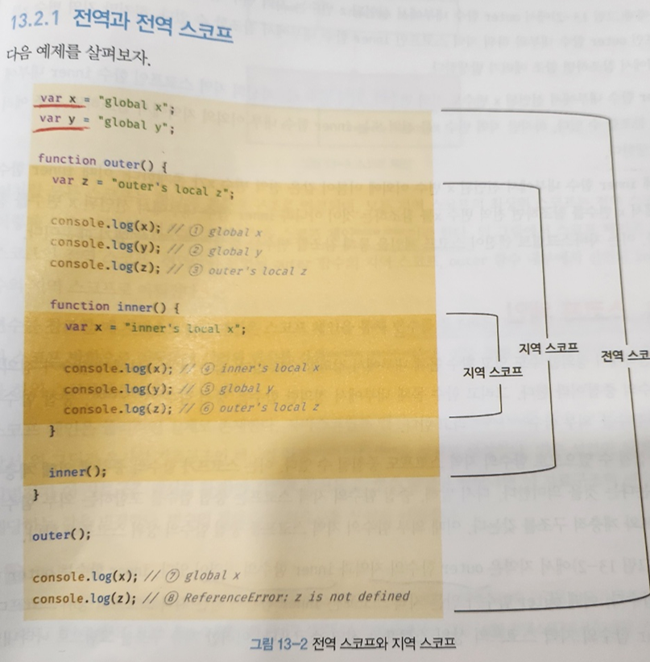

> ## 13. 스코프

- var 키워드로 선언한 변수와 let 또는 const키워드로 선언한 변수의 스코프는 다르게 동작한다.

```
var x = 'global'

function foo(){
    var x = 'local';
    console.log(x) // local 출력
}
foo()

console.log(x);// global 출력
```

--> 설명 <br>

- 자바스크립트 엔진은 이름이 같은 두 개의 변수 중에서 어떤 변수를 참조해야 할것인지 결정한다. 이를 식별자 결정 이라고 한다. <br>
  스코프란 자바스크립트 엔진이 식별자를 검색할 떄 사용하는 규칙이라고 할수 있다.
- 자바스크립트 엔진은 코드를 실행할 때 코드의 문맥을 고려한다.<br> 코드가 어디서 실행되며 주변에 어떤 코드가 있는지에 따라 위 예제처럼 같은 변수여도 다른 결과를 만들어 낸다.

```
function bar(){
    let x = 1;
    let x = 2; // error
}
bar();
```

--> 설명 <br>
let 이나 const 키워드로 선언된 변수는 같은 스코프 내에서
중복선언을 허용하지 않는다.

---

### 스코프 체인<br>

- 모든 스코프는 하나의 계층적 구조로 연결되며, 모든 지역 스코프의 최상위 스코프는 전역 스코프다. 이렇게 스코프가 계층적으로 연결 된것을 스코프 체인 이라고 한다.

- 변수를 참조할 떄 자바스크립트 엔진은 스코프 체인을 통해
  변수를 참조하는 코드의 스코프에서 시작하여 상위 스코프 방향으로 이동하며 선언된 변수를 검색한다.


-->설명 <br>

- 4번 x변수를 참조하는 코드의 스코프인 inner 함수의 지역 스코프에서 x변수가 선언되었는지 검색한다. <br>
  inner 함수 내에는 선언된 x 변수가 존자하므로 검색된 변수를 참조하고 검색을 종료한다. <br>
- 5번 y변수를 참조하는 코드의 스코프인 inner함수의 지역 스코프에서 y 변수가 선언되었는지 검색한다.<br>
  inner함수 내에는 y 변수의 선언이 존재하지 않으므로 상위 스코프인 outer 함수의 지역스코프로 이동한다. outer 함수 내에도 y변수의 선언이 존재하지 않으므로 또 다시 상위 스코프인
  전역 스코프로 이동한다.<br>
  전역 스코프에는 y변수의 선언이 존재한다. <br>따라서 검색된 변수를 참조하고 검색을 종료한다.<br>

  --> 이처럼 자바스크립트 엔진은 스코프 체인을 따라 변수를 참조하는 코드의 스코프에서 시작해서 상위 스코프 방향으로 이동하며 선언된 변수를 검색한다. <br>
  절대 하위 스코프로 내려가면서 식별자를 검색하는 일은 없다.<br>
  --> 상위 스코프에서 유효한 변수는 하위 스코프에서 자유롭게 참조할 수 있지만 하위 스코프에서 유효한 변수를 상위 스코프에서 참조할 수 없다는 의미이다.(부모의상속과 비슷.ㅎㅎ)

  ```
  let c = 7;
  {
  let c = 3;
  let b = 5;
  console.log(c, b); // 3 5
  {
    let c = 3;
    let d = 2;
    console.log(c, b, d); // 3 5 2
  }
  console.log(b); // 5
  }
  // 지역변수가 전역변수보다 더 높다.
  let A = 7; //A가 7에서 4로 바뀐다.
  function f() {
  let B = 5;<br>
  console.log(A, B); // 7 5
  A = 4;

    function fb() {
    let C = 5;
    let A = 3;
    console.log(A, B, c); // 3 5 5
    A = 5; //지역변수
    }

    fb();
    console.log(A); // 4
    }
    f( );
  ```
