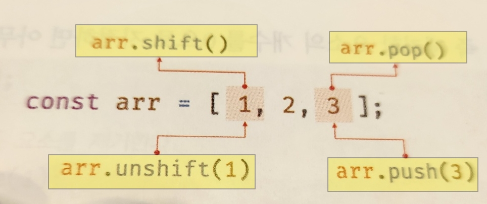

> ## 27.배열 리터럴

- 객체와 마찬가지로 배열도 다양한 생성 방식이 있다.
- 배열 리터럴을 사용하는 것이다.
- 대괄호 안에 있는것을 배열 리터럴 이라한다.

> > ### 희소성

- 배열 리터럴에 요소를 생략하면 희소 배열이 생성된다.

```
// 희소성
const arr2 = [, 6, 7, 8];
console.log(arr2.length);
console.log(arr2[0]); // undefined

```

> > ### Array 생성자 함수

- object 생성자 함수를 통해 객체를 생성할 수 있듯이 Array 생성자 함수를 통해 배열!!!을 생성할 수 있다.

- Array 생성자 함수는 전달된 인수의 개수에 따라 다르게 동작하므로 주의

```
const arr = new Array(10)
console.log(arr)// [empty * 10]
console.log(arr.length) // 10
```

<br>

- 전달된 인수가 없는 경우 빈 배열을 생성한다. <br>
  즉, 배열 리터럴 [ ]과 같다.

```
new Array() // [ ]
```

<br>

- 전달된 인수가 2개 이상이거나 숫자가 아닌 경우 인수를 요소로 갖는 배열을 생성한다.

```
new Array(1,2,3); // [1,2,3]
```

<br>
- Array 생성자 함수는 new 연산자와 함께 호출하지 않더라도, 즉 일반 함수로서 호출해도 배열을 생성하는 생성자 함수로 동작한다.
이는 Array 생성자 함수 내부에서 new.target을 확인하기 때문이다.

```
Array(1,2,3); // [1,2,3]
```

<br>

```
// 전달된 인수가 1개지만 숫자가 아니면 인수를 요소로 갖는 배열을 생성한다.

new Array( { } ); // [ { } ]

// 전달된 인수가 1개이고 숫자이더라도 인수를 요소로 갖는 배열을 생성한다.
 Array.of(1); // [1]
 Array.of(1,2,3); // [1,2,3]
 Array.of('string'); // ['string']

```

> ### Array 배열 메서드

Array.prototype,unshift

- 인수로 전달받은 모든 값을 원본 배열의 선두에 요소로 추가하고 변경된
  length 프로퍼티 값을 반환한다.
- 원본배열을 직접 변경한다.

```
const arr = [1, 2];
let result = arr.unshift(3, 4);
console.log(arr);

[ 3, 4, 1, 2 ]출력됨.

원본배열을 건드리기 때문에 아래코드로 많이 쓴다.

// ES6 스프레드 문법
const newArr = [3, ...arr];
console.log(arr);

```

Array.prototype.shift

- 원본배열애ㅔ서 첫 번째 요소를 제거하고 제거한 요소를 반환한다.
- 원본 배열을 직접 변경한다.

Array.prototype.concat

- 인수로 전달된 값들(배열 또는 원시값)을 원본 배열의 마지막 요소로 추가한 새로운 배열을 반환한다.
- 인수로 전달한 값이 배열인 경우 배열을 해체하여 새로운 벼열의 요소로 추가한다.
- 원본 배열은 변경되지 않는다.


--> 그림으로 한번에 설명되네.ㅎㅎ

splice(start, delteCount, items) <br>
return은 제거한 요소를 반환한다.

```
// return 제거한 요소가 반환!!
const arr3 = [1, 2, 3, 4];
const result3 = arr3.splice(1, 2);
console.log(arr3); //[1,4]
console.log(result3); // [2,3]

// 삭제해야할 값이 없다면
const arr4 = [1, 2, 3, 4];
const result4 = arr4.splice(1, 2, 100, 200);
console.log(arr4); //[1 100 200 4]
console.log(result4); // [2,3]

// 제거할 요소의 개수를 생략하면 첫번째 인수로 전달된
시작 인덱스부터 모든 요소를 제거한다.
const arr5 = [1, 2, 3, 4];
const result5 = arr5.splice(1);
console.log(arr5); //[1]
console.log(result5); // [2,3,4]

// ##
**** indexOf를 종합 이용한 예제 ****
*** 이거 알면 splice 다 아는 거임! ***

const arr6 = [1, 2, 3, 1, 2];

function remove(array, item) {
const index = array.indexOf(item);
//item 2 --> 1
//item 10 -> -1
console.log(index);

if (index != -1) array.splice(index, 1);
//item 2-->index1
// 1과 -1이 같지 않다면--같지않지 - array.splice(1,1)
// 1부터 한개 지우면 남는것이 [1 3 1 2]

// item 10 --> array.indexOf(10)-> index =-1이다.
// -1과 -1은 거짓이므로 return array --> 위에서 splice는 원본배열에서 삭제되는것이므로
// 원본 배열은 [1,3,1,2]가 된다.
// console.log(remove(arr6, 10));에서는 10이 없으므로 원본배열
// [1,3,1,2] 그대로 출력된다.
return array;
}
console.log(remove(arr6, 2));
console.log(remove(arr6, 10));

```

## filter

배열의 요소를 순회하면서 콜백 함수를 사용하여 원하는 조건에 따라 필터링하는 함수이다.
필터링된 배열을 반환한다.

- filter() 함수를 호출할 때, 필터링할 배열을 콜백 함수에 전달합니다.
- filter() 함수는 필터링할 배열의 첫 번째 요소를 선택하고, 이 요소를 콜백 함수의 첫 번째 매개변수(element)로 전달합니다.
- 콜백 함수가 호출되고, 전달된 요소는 콜백 함수 내에서 사용할 수 있습니다. 이 콜백 함수 내에서 필요한 조건을 적용하고, return 키워드를 사용하여 해당 요소가 필터링 조건을 충족하는지 여부를 판단합니다.
- 콜백 함수가 true를 반환하면, 현재 요소는 필터링된 배열에 포함됩니다. false를 반환하면 현재 요소는 필터링된 배열에 포함되지 않습니다.
- filter() 함수는 다음 배열 요소를 선택하고 이와 같은 과정을 반복합니다.
  모든 배열 요소에 대한 콜백 함수 호출이 완료되면, filter() 함수는 필터링된 결과를 포함하는 새로운 배열을 반환합니다.
- 반환된 배열에는 콜백 함수에서 true를 반환한 요소들만 포함됩니다.

```
const numbers = [1, 2, 3, 4, 5, 6, 7, 8, 9];

const uniqueNumbers = numbers.filter((element) => {
  return element % 2 === 0 && element < 5;
});
console.log(uniqueNumbers);

```
