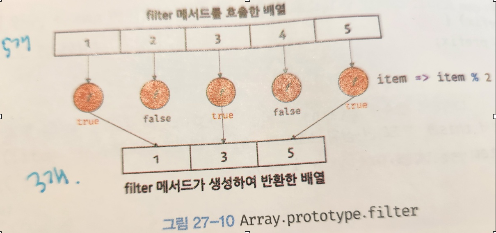

> ## 내장함수 샘플 예제

```
/*----------push---------
arr = ["짱구", "흰둥이"];
arr.push("박희정");
console.log(arr);
*/

//*----------pop-----------
/*arr.pop("박희정");
console.log(arr);
*/

// 문제) 만약 arr에 크로미가 없다면 쿠로미를 맨 끝 요소에 추가해라
// array.js에 나옴
//const arr = ["짱구", "흰둥이"];

// 블로그 정리해 놨음.
// const은 선언과동시에 할당 해야함 const 객체의 업데이트는 됨.
// 재선언.재할당 불가. /  let은 재할당은 가능
// 재선언 : 똑같은 변수가 또 있을때.
/*
if (!arr.includes("크로미")) {
  arr.push("크로미");
}
console.log(arr);
*/

//-------unshift()-------------
// ()안의 데이터를 원본 배열의 맨 앞에 추가.
/*
arr.unshift(0);
console.log(arr);
arr.shift(0);
console.log(arr);
*/

//------  concat( )  -------------
// arr1.concat() --> 결과는 배열로 나온다.
// arr1과 ()안을 연결해서 하나의 복사본을 만든다.
const letters = ["a", "b", "c"];
const numbers = [1, 2, 3];
// let a = letters.concat(numbers);
letters.concat(numbers);
console.log(letters.concat(numbers));

/*세배열로 연결하기*/
const num1 = [1, 2, 3];
const num2 = [4, 5, 6];
const num3 = [7, 8, 9];
let b = num1.concat(num2, num3);
console.log(b);

// --------join() ------- // 배열사이()안의 원하는 문자가 삽입된 문자열!!을 반환
const ph = ["010", "1234", "1234"];
console.log(ph[0]); // [010] 이 아닌 010으로 출력
const strph = ph.join("-");
console.log(strph); // 010-1234-1234

// ---reverse() //  원본배열 역순 배치
const ph1 = ["안", "녕"];
// const ph1 = [1, 2, 3];
ph1.reverse();
console.log(ph1);

// ---split() -------
//문자열을 ()안의 문자기준!!으로 배열로 생성
const ph2 = "안녕하세요";
ph2.split(""); // 빈문자열
console.log(ph2.split("")); // ['안','녕','하','세','요']

// ex) ["010","1234","1234"] 출력하게하려면.
const ph3 = "010-1234-1234";
ph3.split("-");
console.log(ph3.split("-")); // - 기준이므로.["010", "1234", "1234"];

// --- splice(start, count, item) -------
// 원본 배열의 요소를 제거
// 제거한 부분에 item을 대체
// start(index), count(개수)
const arr3 = [1, 2, 3, 4, 5, 6, 7, 8, 9];
arr3.splice(2, 3, "hi");
console.log(arr3.splice(2, 3, "hi")); // [1, 2, 'hi', 6, 7, 8, 9]

console.log(arr3.splice(3, 2, "hi")); // [1, 2, 'hi', 'hi', 8, 9,]

// --- slice(start, end) -------
// 이 범위에 있는 친구가 필요해
// 원본 배열의 특정 구간을 잘라서 복사본을 생성
// start 부터 시작해서 end직전의 index까지 범위(end포함하지않는다.)
const arr4 = [1, 2, 3, 4, 5, 6, 7];
arr4.slice(2, 6); // [3,4,5,6]
let c = arr4.slice(2, 6);
console.log(c);

/*
문제)
연락처 "010-1234-1234" --> ["010","1234","1234"] --> - 기준으로..-->split
해당 연락처의 가운데 숫자를 *로 표기하여 --뽑아내서 ****로 바꾼다.
반환하는 함수를 작성하세요
매개변수는 문자열 연락처가 입력 값으로 들어갑니다.
출력 값은 "010-****-1234"
*/
/*
split 문자를 배열로 만든다.
slice는 얻고자하는 것을  배열을 추출할수있따.
join으로 이 둘을 합친다. join은 배열을 문자열로 반환한다.
*/

//1. 문자열을 "-" 기준으로 배열로 반환 --> split
/*const ex = "010-1234-1234";
console.log(ex);
*/

// ex.split("-");
// console.log(ex.split("-"));

// 2. 가운데 "-"를  "****"로 바꾼다.
/*
const spliceeex = ex.split("-"); // 변수에 담는다.
//console.log(spliceeex);  ["010","1234","1234"]


spliceeex[1] = "****"; // 배열에서 수정하는 방법.
console.log(spliceeex); // ["010", "****", "1234"];

// 배열 없애기 "-"추가. --> join
const joina = spliceeex.join("-");
console.log(joina);

/*
-연락처 "010-1234-1234"
-해당 연락처의 가운데 숫자를 *로 표기하여 ---배열로표기split
-반환하는 함수를 작성하세요
-매개변수는 문자열 연락처가 입력 값으로 들어갑니다.
-출력 값은 "010-****-1234"
*/

//반환하는 함수
console.log("-------------------");

/* 정상적으로 나오지만 오류 : 함수를 안만들어보면 변수에 넣어줘야한다.

const ex = "010-1234-1234"; // 전역변수

function array01() {
  let sph = ex.split("-"); // "-"기준으로 배열만듬
  console.log(sph);
  sph[1] = "****"; // 가운데 ****수정
  let resultsph = sph.join("-"); // 문자열로 바꿔주고 "-"추가
  console.log(resultsph);
  return;
}
array01();
*/
console.log("-------------------");

function phoneNumber(phone) {
  // 배열을 만들어 준다.
  let splitph = phone.split("-");
  console.log(splitph);

  // 가운데 바꿔준다.
  splitph[1] = "****"; // ["010","****","7894"]
  console.log(splitph);

  let hashedph = splitph.join("-"); // 문자열로 변환하고 '-'추가
  console.log(splitph.join("-"));

  return hashedph;

  // 문자로 바꿔주고 "-"추가한다. --> join()
}
phoneNumber("010-2365-2222");

/*
function hashedPhoneNumber(phone) {
  const splitph = phone.split("-");
  splitph[1] = "****";
  const hashedPh = splitph[1].join("-");
  return hashedPh;
}
hashedPhoneNumber("010-2657-2480");
*/

console.log("막간의 콜백함수 예제-----");
/*
function main(x) {
  console.log("준비작업");
  const name = "heejung";
  x(name); //sayHi의 함수내용이 있음.
  // sayHi와 x가 같은거임.
}

function sayHi(name) {
  console.log(name + "님, 안녕");
}
main(sayHi);
console.log("막간의 콜백함수-----");
*/
```

> ## 고차함수 예제
>
> > ### map()

```
console.log("------------안녕하세요 예제---------------");
const posts = [
 {
   id: 1,
   title: "안녕하세요-1",
 },
 {
   id: 2,
   title: "안녕하세요-2",
 },
];
[("<div>안녕하세요-1</div>", "<div>안녕하세요-2></div>")];

const hello = posts.map((aaa, i) => {
 //console.log(aaa);
 //console.log(i);
 if (i % 2 === 0) return; // 0번째는 참이므로 undefined
 return aaa.title; // 1번쨰는 거짓이므로title반환.
});
console.log(hello); //[undefined, '안녕하세요2']출력

const titles = posts.map((aaa) => aaa.title); // 모든 index반환.
console.log(titles);
// ["안녕하세요-1", "안녕하세요-2"]출력

console.log("------map [희정아][커피끊자]출력 다른예제------ ");

console.log("------map 2n 다른예제------ ");
//console.log(results); // [20, 40, 60]
//배열을 만들어서 순회를 해서새배열을 만들고 배열의 두배가 나오게 해라.
// 배열나온 것중에 가운데 숫자를 입력하면 모두 **로 나오게 함수를 만들어라

/* 자연어 풀이
const results = arr2n.map()--> 안에 콜백함수의 매개변수를 넣어서 인덱스에 해당하는
개체를 순회하게 하려면.
const results = arr2n.map((bbb,i) => {
 i인덱스에 담는 bbb 개체내용들을 두배로 하면 되잖아. bbb * 2
 이걸 코드블럭 console.log에 찍어야하니 return!!!
})
*/
/*
const arr2n = [10, 20, 30];
const results = arr2n.map((bbb, i) => {
 console.log(i); // 0,1,2
 console.log(bbb); // 10,20,30 이 의미를 아니까 이해됨. 콜백함수 조금은.
 return bbb * 2;
});
console.log(results); //[20,40,60]
*/
// 가운데 배열에 **을 추가하고 함수를 만들어라.
// arr2n[1] = "**"

//공통인자로 받고싶을때
function addstar(arr) {
 const results = arr.map((el) => {
   return el * 2;
 });
 console.log(results); //[42,62,82] results는 변수이므로 addstar함수 안에서 쓸수있다.
 return results;
}
addstar([21, 31, 41]); //[42,62,82]
//만약 리턴값을 외부변수로 할당
// let a = addstar([21, 31, 41]);
// console.log(a);

function addstar1(...args) {
 const results = args.map((el) => {
   return el * 2;
 });
 console.log(results);
 return results;
}

addstar1(15, 22, 33);

/****************내가 작성한 오류함수.!!!!*********************
const arrs = [a, b, c]; //오류

function addstar(arr, i) {
 console.log(arr);
 console.log(i);
 const results = arrs.map((arr, i) => {
   return arr * 2;
 });
}
console.log(results);
addstar(20, 40, 60); // 숫자를 넣었음 인자를 배열로 넣기!
*/

console.log("------여기부터 다른 예제-------");
//map() 함수예제
const numbers = [1, 2, 3, 4, 5];

const doubleNumbers = numbers.map(function (n) {
 return n * 2;
});
console.log(doubleNumbers);

//  화살표함수로 바꾸면
//const doubleNumbers = numbers.map((number) => number * 2);
// console.log(doubleNumbers);

// ******************ex1 map() 문자열을 대문자로 변환하시오*****************
// const fruits = ["Apple", "Banana", "Cherry"];
// toLowerCase(); // 소문자로 변환
//--> 배열이 아니라 문자열로 바꾸시오. "apple","banana","cherry"

/*
1.
const fruits = ["Apple", "Banana", "Cherry"];
const low = fruits.map((fruit) => fruit.toLocaleLowerCase());
console.log(low); //["apple", "banana", "cherry"]

익명함수로 변환.
const low = fruits.map(functon(fruit){
 return fruit.toLocalLowerCase()
})
console.log(low)

2. 자연어 해석
배열을 문자열로 변환 -join
split는 문자열을 배열로 변환.

const fruits = ["Apple", "Banana", "Cherry"];

const low = fruits.map((fruit) => fruit.toLocaleLowerCase());
console.log(low); //["apple", "banana", "cherry"]
const f_string = low.join("\n");
console.log(f_string);

3. 함수로 정의 - 리터럴 글을 아무글이나 해도 될수있게.*/

function fruitTag(item) {
 const lower = item.map((el) => el.toUpperCase());
 // console.log(lower); //[ 'APPLE', 'BANANA', 'CHERRY' ]
 const f_string = lower.join("\n"); //줄바꿈
 // console.log(f_string);

 return f_string;
}
// console.log(lower); //error
let a = fruitTag(["Apple", "Banana", "Cherry"]);
console.log(a);

// APPLE
// BANANA
// CHERRY

// *************ex2 map() 값추출********************
// 사용자 객체 배열에서 사용자 이름만 추출하여 새로운 배열을 생성하시오. map()

const users = [
 { id: 1, name: "Alice" },
 { id: 2, name: "Bob" },
 { id: 3, name: "Charlie" },
];
// 객체 순회해서 사용자 이름 추출 , 새로운 배열 생성
// 사용자 이름만 추출
const users1 = users.map((n) => n.name);
console.log(users1); // ["Alice","Bob","Charlie"]

// 익명함수로 변환
//const users1 = users.map(function (user) {
//   return user.name;
// });
// console.log(users1);

//***********ex3 map() 조건대체******************** */
// map() 함수는 numbers 배열의 각 숫자가 짝수인지 홀수인지 판별하여,
// 짝수일 경우 'Even', 홀수일 경우 'Odd'로 대체하여
// modifiedNumbers 배열을 생성합니다.
// numbers_map[n+2] = 짝수
// numbers_map[n] = 홀수
/*
자연어풀이
const number s = [10,11,12,13,14,15]
짝수
const modifiedNumbers = if(number%2 === 0){
 console.log("${number}는 even")
}else {
 console.log("${number}는 odd")
}
*/
const numbers_map = [10, 11, 12, 13, 14, 15];
const modifiedNumbers = numbers_map.map((number) =>
 number % 2 === 0 ? "even" : "odd"
);
//삼항연산자와 화살표함수
// 조건 ? 값1 : 값2

//   if (number % 2 === 0) {
//     return "even";
//   } else {
//     return "odd";
//   }
// });

console.log(modifiedNumbers);
```

> ## 2. filter()

- filter메서드는 자신을 호출한 배열의 모든 요소를 순회하면서 인수로 전달받은 콜백 함수를 반복 호출한다.
- 콜백 함수의 반환값이 true인 요소로만 구성된 새로운 배열을 반환한다.
  이때 원본 배열은 변경되지 않는다.
- 특정한 배열에서 내가 원하는 요소들만 찾아서 새로운 배열을 반환
  특정한 조건에 맞는 배열, 특정한 값을 삭제한 배열
- filter메서드가 생성하여 반환한 새로운 배열의 length프로퍼티 값은 filter메서드를 호출한 배열의 length프로퍼티 값과 같거나 작다.<br>
  <br>


